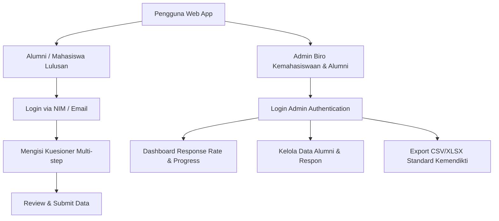
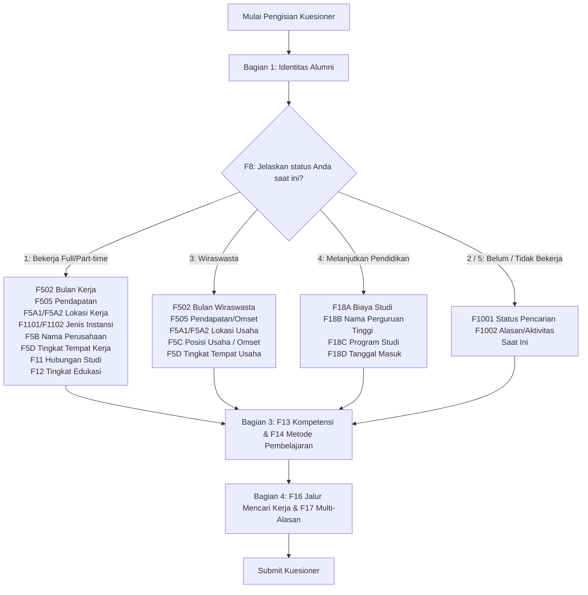

# PRD & DESIGN SPECIFICATION: TAU TRACER STUDY & GRADUATE EMPLOYABILITY TRACKER

**Sistem Kuesioner Tracer Study Berstandar Kemendiktisaintek dengan Direct Export Import-Ready Portal Dikti**  
**Tanri Abeng University (TAU)**

---

## 1. EXECUTIVE SUMMARY & PROBLEM STATEMENT

### 1.1 Latar Belakang & Permasalahan Utama
Saat ini, pelaksanaan Kuesioner Tracer Study di Tanri Abeng University (TAU) yang dikelola oleh Biro Kemahasiswaan & Alumni menghadapi kendala teknis dan operasional yang signifikan:
1. **Inefisiensi Data Pipeline (Google Forms)**: Pengumpulan data alumni menggunakan Google Forms menghasilkan struktur kolom mentah yang **tidak sesuai** dengan format skema baku pengisian portal Tracer Study Kemendiktisaintek (Belmawa).
2. **Kebutuhan Manual Formatting & Mapping**: Tim Kemahasiswaan harus melakukan pembersihan data, pengkodean ulang (*re-coding*), pencocokan variabel ($F8$, $F502$, $F505$, $F13$, $F14$, dll.), dan transformasi format file secara manual sebelum mengunggah (*bulk upload*) ke sistem Dikti. Proses ini memakan waktu mingguan dan rawan human error (salah kolom/penamaan).
3. **Branching Logic yang Kompleks**: Kuesioner Kemendikti memiliki logika percabangan kondisional yang dinamis (contoh: alumni yang bekerja mengisi $F502$ bulan kerja + $F505$ pendapatan; alumni wiraswasta mengisi $F5C$ posisi usaha; alumni yang belum/tidak bekerja melompati kolom finansial). Google Forms sering kali membingungkan responden dalam menavigasi pertanyaan percabangan ini.
4. **Respon Rate & UX**: Tampilan Google Forms yang standar dan kurang merepresentasikan identitas visual Tanri Abeng University mengurangi motivasi alumni dalam berpartisipasi (*low completion rate*).

### 1.2 Solusi Sistem
Membangun web aplikasi **TAU Tracer Study & Employability Tracker** yang didesain khusus untuk:
- Menggantikan Google Forms dengan antarmuka kuesioner interaktif multi-step bertema **Tanri Abeng University Identity (Navy Blue & Warm Gold)**.
- Menerapkan **Conditional Branching Engine** otomatis secara real-time di sisi client.
- Menyediakan **Kemendikti Direct Export Engine** yang secara otomatis meng-generate file CSV / Excel `.xlsx` dalam struktur header baku Kemendikti (siap *drag-and-drop upload* ke portal Dikti tanpa perbaikan manual).
- Menyediakan **Dashboard Analytics Biro Kemahasiswaan (Admin)** untuk memantau *response rate*, melacak status pengisian alumni per prodi/angkatan, dan memvisualisasikan indikator kinerja utama (*Main Indicators*).

---

## 2. USER PERSONAS & ROLE-BASED ACCESS CONTROL (RBAC)

Sistem ini memiliki 2 aktor/role utama:



### 2.1 Role 1: Alumni / Mahasiswa Lulusan (User Responden)
- **Tujuan**: Mengisi data tracer study dengan cepat, intuitif, transparan, dan dapat diakses dari perangkat mobile/desktop.
- **Fitur Utama**:
  - Auto-fill identitas berbasis NIM / Email alumni yang terdaftar.
  - Form Wizard / Stepper Interaktif (Progress bar per langkah).
  - Validation engine (mencegah format NIK/NPWP/No HP salah sebelum submit).
  - Kemampuan menyimpan draft (*Auto-Save progress*) jika kuesioner belum selesai diisi.
  - Ringkasan jawaban (*Submission Summary*) & Konfirmasi Tanda Terima Pengisian.

### 2.2 Role 2: Biro Kemahasiswaan & Alumni (Admin System)
- **Tujuan**: Memantau partisipasi alumni, mengekspor data siap upload Kemendikti, dan mengunduh dataset untuk analisis Lanjutan/Skripsi.
- **Fitur Utama**:
  - **Overview Metrics**: Total Alumni Lulus, Total Responden (Bekerja, Wiraswasta, Lanjut Studi, Belum Bekerja), Response Rate (%).
  - **Filter & Search Engine**: Filter data berdasarkan Tahun Lulus, Kode Prodi, Status Kerja ($F8$), dan pencarian nama/NIM.
  - **Kemendikti Export Hub**: Tombol 1-Click Export CSV/XLSX berstandar Kemendiktisaintek.
  - **Dataset ML Exporter**: Export dataset yang telah di-encode numerik ($F8$, $F502$, $F11$, $F13$, $F14$) untuk kebutuhan pengolahan data Skripsi/Research.
  - **Alumni Reminder Engine**: Melacak alumni yang belum mengisi kuesioner dan menyediakan opsi kirim pengingat via Email / WhatsApp link.

---

## 3. SPESIFIKASI SKEMA KUESIONER & CONDITIONAL BRANCHING LOGIC

Kuesioner disusun secara rinci mengikuti variabel resmi **Kemendiktisaintek (Belmawa)**:



### 3.1 Bagian 1: Identitas Alumni (Wajib)
| Kode Variables | Label Pertanyaan | Tipe Input | Rule / Validasi |
| :--- | :--- | :--- | :--- |
| `nim` | NIM Mahasiswa | Text Input | Mandatory, Numeric, 9-12 Digit |
| `kdptim` | Kode PT | Text Input (Default: `031041`) | Read-only / Auto-fill (Tanri Abeng University) |
| `tahun_lulus` | Tahun Lulus | Select Dropdown | Mandatory (e.g. 2021, 2022, 2023, 2024, 2025) |
| `kdpst` | Kode Prodi | Select Dropdown | Mandatory (Management, Accounting, CS, IT, Petroleum, etc.) |
| `nama` | Nama Mahasiswa | Text Input | Mandatory, Alphabetic |
| `hp` | Nomor Telepon / HP | Phone Input | Mandatory, Valid Indonesian Phone (+62 / 08) |
| `email` | Alamat Email | Email Input | Mandatory, Valid Email Regex |
| `nik` | NIK (Nomor Induk Kependudukan) | Text Input | Mandatory, Exactly 16 Digits Numeric |
| `npwp` | NPWP | Text Input | Optional, 15/16 Digits Numeric |

### 3.2 Bagian 2: Kuesioner Wajib Status Pekerjaan ($F8$) & Percabangan

#### **Pertanyaan Utama: $F8$**
**Jelaskan status Anda saat ini?**
- `1` = Bekerja (fulltime / parttime)
- `3` = Wiraswasta
- `4` = Melanjutkan Pendidikan
- `2` = Belum memungkinkan bekerja
- `5` = Tidak kerja tetapi sedang mencari kerja

---

#### **Branch A: Jika $F8 = 1$ (Bekerja)**
1. **$F502$**: Dalam berapa bulan Anda mendapatkan pekerjaan pertama? *(Numeric Input, Bulan)*
2. **$F505$**: Berapa rata-rata pendapatan Anda per bulan? *(Numeric Input, IDR Rupiah tanpa titik/koma)*
3. **$F5A1 / F5A2$**: Lokasi tempat Anda bekerja? *(Dropdown Provinsi & Kab/Kota)*
4. **$F1101 / F1102$**: Apa jenis perusahaan/instansi tempat Anda bekerja?
   - `1` = Instansi pemerintah (termasuk BUMN)
   - `2` = Organisasi non-profit / Lembaga Swadaya Masyarakat
   - `3` = Perusahaan swasta
   - `4` = Perusahaan BUMN/BUMD
   - `5` = Lainnya
5. **$F5B$**: Apa nama perusahaan/instansi tempat Anda bekerja? *(Text Input)*
6. **$F5D$**: Apa tingkat tempat kerja Anda?
   - `1` = Lokal / Wilayah tidak berbadan hukum
   - `2` = Nasional / Berbadan hukum
   - `3` = Multinasional / Internasional
7. **$F11$**: Seberapa erat hubungan antara bidang studi dengan pekerjaan Anda?
   - `1` = Sangat Erat | `2` = Erat | `3` = Cukup Erat | `4` = Kurang Erat | `5` = Tidak Erat Sama Sekali
8. **$F12$**: Sesuai dengan tingkat pendidikan apa pekerjaan Anda saat ini?
   - `1` = Setingkat Lebih Tinggi | `2` = Tingkat yang Sama | `3` = Setingkat Lebih Rendah | `4` = Tidak Perlu Pendidikan Tinggi

---

#### **Branch B: Jika $F8 = 3$ (Wiraswasta)**
1. **$F502$**: Dalam berapa bulan setelah lulus Anda memulai wiraswasta? *(Numeric Input, Bulan)*
2. **$F505$**: Berapa rata-rata pendapatan/omset bersih Anda per bulan? *(Numeric Input, IDR Rupiah)*
3. **$F5A1 / F5A2$**: Lokasi tempat usaha Anda? *(Dropdown Provinsi & Kab/Kota)*
4. **$F5C$**: Apa posisi/peran Anda dalam usaha tersebut?
   - `1` = Pendiri (Founder)
   - `2` = Pemilik (Owner)
   - `3` = Pekerja Mandiri (Freelancer)
5. **$F5D$**: Apa tingkat cakupan usaha Anda?
   - `1` = Lokal / Wilayah | `2` = Nasional | `3` = Multinasional / Ekspor

---

#### **Branch C: Jika $F8 = 4$ (Melanjutkan Pendidikan)**
1. **$F18A$**: Dari mana sumber biaya studi Anda?
   - `1` = Biaya Sendiri / Orang Tua
   - `2` = Beasiswa Pemerintah / Kampus
   - `3` = Beasiswa Swasta / Tempat Kerja
2. **$F18B$**: Nama Perguruan Tinggi tempat studi lanjut? *(Text Input)*
3. **$F18C$**: Program Studi studi lanjut? *(Text Input)*
4. **$F18D$**: Tanggal/Bulan/Tahun mulai studi lanjut? *(Date Picker)*

---

#### **Branch D: Jika $F8 = 2$ atau $F8 = 5$ (Belum/Tidak Bekerja)**
1. **$F1001$**: Apakah Anda sedang mencari pekerjaan saat ini?
   - `1` = Ya | `2` = Tidak
2. **$F1002$**: Alasan utama belum bekerja / aktivitas saat ini? *(Text Input / Select)*

---

### 3.3 Bagian 3: Kompetensi ($F13$) & Metode Pembelajaran ($F14$) (Skala Dual Rating 1–5)

Responden menilai 7 Aspek Kompetensi pada dua kualifikasi: **(A) Pada Saat Lulus** vs **(B) Diperlukan Saat Ini dalam Pekerjaan**.

| Kode Sub-Variabel | Aspek Kompetensi ($F13$) | Rating Scale |
| :--- | :--- | :--- |
| `F1301A` / `F1301B` | Etika & Moralitas | 1 (Sangat Rendah) – 5 (Sangat Tinggi) |
| `F1302A` / `F1302B` | Keahlian berdasarkan bidang ilmu (Main Competence) | 1 (Sangat Rendah) – 5 (Sangat Tinggi) |
| `F1303A` / `F1303B` | Bahasa Inggris | 1 (Sangat Rendah) – 5 (Sangat Tinggi) |
| `F1304A` / `F1304B` | Penggunaan Teknologi Informasi (TI) | 1 (Sangat Rendah) – 5 (Sangat Tinggi) |
| `F1305A` / `F1305B` | Komunikasi | 1 (Sangat Rendah) – 5 (Sangat Tinggi) |
| `F1306A` / `F1306B` | Kerja Sama Tim | 1 (Sangat Rendah) – 5 (Sangat Tinggi) |
| `F1307A` / `F1307B` | Pengembangan Diri | 1 (Sangat Rendah) – 5 (Sangat Tinggi) |

#### **Metode Pembelajaran di TAU ($F14$)**
Responden menilai seberapa besar kontribusi metode pembelajaran berikut di TAU:
- `F1401`: Perkuliahan regular
- `F1402`: Demonstrasi / Praktikum
- `F1403`: Riset / Magang Kerja (MBKM)
- `F1404`: Diskusi / Kelompok Kerja
- `F1405`: Proyek Lapangan / Studi Kasus

---

### 3.4 Bagian 4: Jalur Mencari Kerja ($F16$) & Alasan Ketidaksesuaian ($F1613 / F1614$)

- **$F1601 - F1615$** (Checkbox Multi-select): Bagaimanakah Anda mencari pekerjaan?
  - `F1601`: Iklan di koran/majalah
  - `F1602`: Melamar langsung ke perusahaan
  - `F1603`: Menyebarkan lembar lamaran (walk-in)
  - `F1604`: Melalui Iklan Internet / LinkedIn / Jobstreet
  - `F1605`: Hubungi agen tenaga kerja
  - `F1606`: Melalui Pusat Karir Kampus TAU (Career Center)
  - `F1607`: Menghubungi alumni / relasi
  - `F1608`: Membangun jaringan usaha
- **$F1613 / F1614$** (Multi-select, Tampil jika $F11 = 4$ atau $5$): Alasan mengambil pekerjaan yang kurang/tidak sesuai dengan bidang studi?
  - `1`: Pekerjaan lebih menarik
  - `2`: Gaji/prospek lebih menjanjikan
  - `3`: Belum mendapatkan pekerjaan yang sesuai
  - `4`: Lokasi lebih dekat/sesuai lokasi domisili

---

## 4. KEMENDIKTI DIRECT EXPORT ENGINE SPECIFICATION

### 4.1 Logika Mappings Header Portal Belmawa
Sistem menghasilkan file `.csv` atau `.xlsx` dengan susunan kolom persis sebagaimana diwajibkan oleh Kemendiktisaintek. 

Jika alumni tidak melewati cabang tertentu (misal $F8=3$ Wiraswasta), maka kolom khusus karyawan ($F1101$, $F5B$) secara otomatis diisi string kosong `""` atau kode null standar Kemendikti.

```csv
kdptim,kdpst,nim,nama,hp,email,nik,npwp,tahun_lulus,f8,f502,f505,f5a1,f5a2,f1101,f1102,f5b,f5c,f5d,f18a,f18b,f18c,f18d,f1301a,f1301b,f1302a,f1302b,f1303a,f1303b,f1304a,f1304b,f1305a,f1305b,f1306a,f1306b,f1307a,f1307b,f1401,f1402,f1403,f1404,f1405,f11,f12,f1601,f1602,f1603,f1604,f1605,f1606,f1607,f1608
```

---

## 5. SYSTEM ARCHITECTURE & DATA MODEL

### 5.1 Tech Stack Recommendation
- **Frontend App**: Next.js 14 (App Router) / React dengan TailwindCSS + Framer Motion (untuk animasi multi-step form yang halus).
- **Icons & UI Components**: Lucide React icons, Radix UI Primitives (Accordion, Tooltip, Dialog), Glassmorphism styling CSS.
- **Backend / API**: Next.js API Routes (Serverless) / Node.js Express.
- **Database**: PostgreSQL / Supabase atau MongoDB (JSON Schema fleksibel untuk kuesioner).
- **Export Utility**: `exceljs` / `xlsx` library & `json2csv` parser.

---

## 6. DESIGN SYSTEM & UI/UX GUIDELINES (TAU BRAND IDENTITY)

Aplikasi kuesioner ini dirancang dengan gaya **Executive Glassmorphism & High-End Academic Portal**, mengambil inspirasi estetika visual resmi Tanri Abeng University (TAU):

### 6.1 Color Palette
- **TAU Primary Navy Blue**: `#0A192F` / `#0F2042` (Warna latar & header dominan, merepresentasikan profesionalisme & akademisi unggul).
- **TAU Accent Warm Gold**: `#D4AF37` / `#E5C158` (Warna aksen tombol aksi, badge penjelas, & border sorotan).
- **Surface Dark Glass**: `rgba(15, 23, 42, 0.75)` dengan `backdrop-filter: blur(16px)` (Container form futuristik & bersih).
- **Text Primary**: `#F8FAFC` (Putih terang untuk keterbacaan maksimal pada tema gelap).
- **Text Secondary**: `#94A3B8` (Abu-abu soft untuk deskripsi variabel $F$).
- **Success / Status Green**: `#10B981` (Selesai diisi / data terverifikasi).

### 6.2 Typography & UI Components
- **Font Family**: Modern Clean Sans-Serif (`Inter`, `Outfit`, atau `Plus Jakarta Sans` via Google Fonts).
- **Form Card Design**: Soft rounded corners (`border-radius: 16px`), border halus `1px solid rgba(212, 175, 55, 0.2)` dengan efek glowing saat di-focus.
- **Interactive Multi-Step Indicator**:
  - Step 1: Data Diri & Identitas ($NIM, NIK$)
  - Step 2: Status Pekerjaan Utama ($F8$)
  - Step 3: Rincian Karir / Studi Lanjut ($F502, F505, F5B$)
  - Step 4: Evaluasi Kompetensi & Pembelajaran ($F13, F14$)
  - Step 5: Jalur Karir & Review ($F16, F17$)
